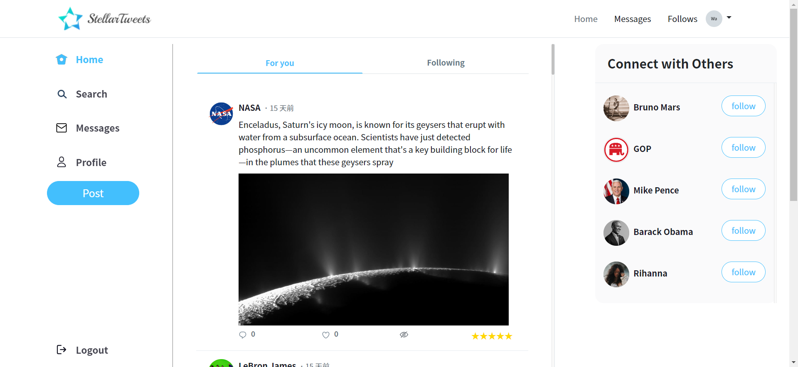

# StellarTweets

StellarTweets is a personal project that aims to create a simple social networking platform. It includes a self-made recommendation system for connecting users with friends and suggesting interesting posts based on their preferences.

> Website URL: [StellarTweets](https://linwaylin.com/)

## Features

- ⭐ Rating: allow users to rate every posts.
- 👍 Recommend: create a recommendation system using collaborative filtering algorithm to suggest friends and posts.
- 🔎 Search: implement Elasticsearch for fuzzy user search and adopted the ICU Analysis plugin along with three custom synonym sets for article search. (synonym sets :&ensp;"chris paul, CP3",&ensp; "拓荒者, 阿拓",&ensp; "小犢, 小牛")
  - fuzzy search  
    Implemented fuzzy search to handle uncertain name spellings, allowing users to find desired results despite spelling mistakes.

    https://github.com/linway035/personal-project/assets/32064935/c6acdb50-aae7-4719-aad0-36fa57eb1712

  - synonym search  
    For instance, a player named "Chris Paul" with the nickname "CP3". When searching for "CP3", the first article's content would display "Chris Paul," but I can still find the result.

    https://github.com/linway035/personal-project/assets/32064935/50b91581-e38d-4134-a657-86f1f85188ef

- 📬 Chatroom: build a real-time chatroom using Socket.IO.
- 🙈 Hide: block posts to prevent them from appearing again permanently.
- 💭 Post: allow users to post tweets and enable them to upload up to three photos using Multer.
- Other features: users can reply to posts and like/unlike them, as well as follow/unfollow other users.

## Tech Stack

**Environment & Framework:** Node.js, Express, Socket.IO

**Database:** MySQL, Elasticsearch

**AWS Service:** EC2, RDS, S3, CloudFront

**Others:** Bootstrap, ORM (Sequelize) , express-handlebars

## MySQL Database Schema

## Server structure

## Test accounts

| Email       | Password |
| :---------- | :------- |
| test@tt.com | test123  |
